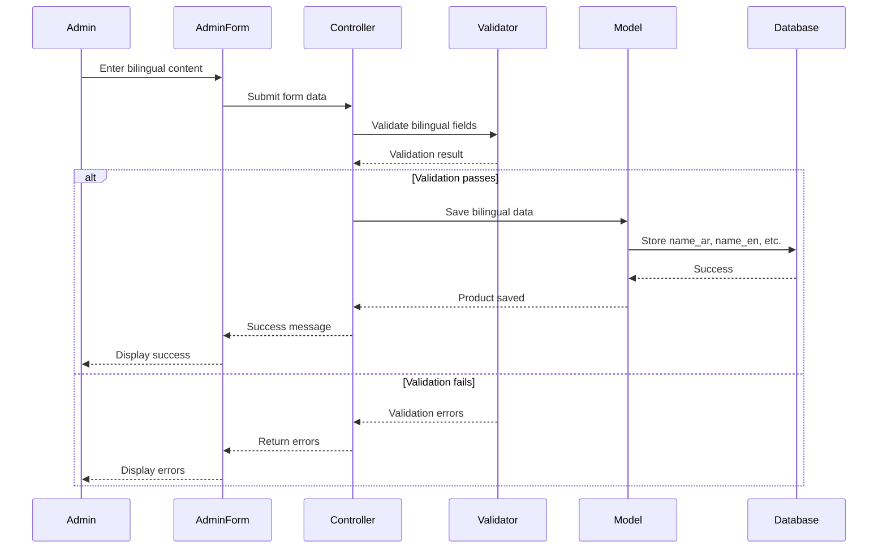

# Design Document

## Overview

This design document outlines the implementation of a comprehensive bilingual (Arabic/English) e-commerce platform with enhanced admin interfaces and mobile-first responsive design. The system builds upon existing multilingual database structures to provide seamless content management and display across both languages, with particular emphasis on mobile device optimization.

The design leverages Laravel's backend capabilities with Vue.js/Inertia.js frontend, utilizing existing translatable traits and database migrations while extending the admin interface to support bilingual content input and ensuring all pages are fully responsive across device sizes.

## Architecture

### High-Level Architecture

```
┌─────────────────────────────────────────────────────────────┐
│                     Presentation Layer                       │
│  ┌──────────────────────┐      ┌──────────────────────────┐ │
│  │   Admin Interface    │      │   Customer Interface     │ │
│  │  (Bilingual Forms)   │      │  (Language Switching)    │ │
│  │  - Product Forms     │      │  - Product Display       │ │
│  │  - Category Forms    │      │  - Category Navigation   │ │
│  │  - Responsive Design │      │  - Mobile Optimized      │ │
│  └──────────────────────┘      └──────────────────────────┘ │
└─────────────────────────────────────────────────────────────┘
                            │
                            ▼
┌─────────────────────────────────────────────────────────────┐
│                     Application Layer                        │
│  ┌──────────────────────┐      ┌──────────────────────────┐ │
│  │   Controllers        │      │   Form Requests          │ │
│  │  - ProductController │      │  - Validation Rules      │ │
│  │  - CategoryController│      │  - Bilingual Validation  │ │
│  └──────────────────────┘      └──────────────────────────┘ │
└─────────────────────────────────────────────────────────────┘
                            │
                            ▼
┌─────────────────────────────────────────────────────────────┐
│                      Domain Layer                            │
│  ┌──────────────────────┐      ┌──────────────────────────┐ │
│  │   Models             │      │   Traits                 │ │
│  │  - Product           │      │  - TranslatableProduct   │ │
│  │  - Category          │      │  - TranslatableCategory  │ │
│  └──────────────────────┘      └──────────────────────────┘ │
└─────────────────────────────────────────────────────────────┘
                            │
                            ▼
┌─────────────────────────────────────────────────────────────┐
│                      Data Layer                              │
│  ┌──────────────────────────────────────────────────────────┐│
│  │   Database Tables                                         ││
│  │  - products (name_ar, name_en, description_ar, ...)      ││
│  │  - categories (name_ar, name_en, slug_ar, slug_en)       ││
│  └──────────────────────────────────────────────────────────┘│
└─────────────────────────────────────────────────────────────┘
```

### Component Interaction Flow



## Components and Interfaces

### 1. Admin Product Form Component

**Purpose**: Provide bilingual input interface for product management

**Component Structure**:
```typescript
interface BilingualProductFormProps {
    product?: Product;
    categories: Category[];
    errors: Record<string, string>;
}

interface BilingualProductFormData {
    // English fields
    name_en: string;
    description_en: string;
    slug_en: string;
    
    // Arabic fields
    name_ar: string;
    description_ar: string;
    slug_ar: string;
    
    // Common fields
    price: number;
    stock: number;
    category_id: number;
    is_active: boolean;
    is_donatable: boolean;
    image?: File;
    images?: File[];
}
```

**Key Features**:
- Tabbed interface for language switching (English/Arabic tabs)
- Real-time slug generation for both languages
- Character counters for description fields
- Visual indicators for required fields
- Responsive layout adapting to screen size

### 2. Admin Category Form Component

**Purpose**: Provide bilingual input interface for category management

**Component Structure**:
```typescript
interface BilingualCategoryFormProps {
    category?: Category;
    errors: Record<string, string>;
}

interface BilingualCategoryFormData {
    name_en: string;
    name_ar: string;
    slug_en: string;
    slug_ar: string;
    is_active: boolean;
    sort_order: number;
}
```

### 3. Product Display Component

**Purpose**: Display product information in the selected language

**Component Structure**:
```typescript
interface ProductDisplayProps {
    product: Product;
    locale: 'ar' | 'en';
}

// Uses TranslatableProductTrait accessors
// Automatically displays name_ar or name_en based on locale
```

### 4. Responsive Layout Components

**Purpose**: Ensure mobile-first responsive design across all pages

**Breakpoint Strategy**:
```css
/* Mobile First Approach */
/* Base styles: Mobile (< 640px) */
.product-grid {
    grid-template-columns: 1fr;
}

/* Small tablets (≥ 640px) */
@media (min-width: 640px) {
    .product-grid {
        grid-template-columns: repeat(2, 1fr);
    }
}

/* Tablets (≥ 768px) */
@media (min-width: 768px) {
    .product-grid {
        grid-template-columns: repeat(2, 1fr);
    }
}

/* Desktop (≥ 1024px) */
@media (min-width: 1024px) {
    .product-grid {
        grid-template-columns: repeat(3, 1fr);
    }
}

/* Large Desktop (≥ 1280px) */
@media (min-width: 1280px) {
    .product-grid {
        grid-template-columns: repeat(4, 1fr);
    }
}
```

### 5. Backend Controllers

**ProductController Enhancements**:
```php
class ProductController extends Controller
{
    public function store(Request $request)
    {
        // Validate bilingual fields
        $validated = $request->validate([
            'name_en' => 'required_without:name_ar|string|max:255',
            'name_ar' => 'required_without:name_en|string|max:255',
            'description_en' => 'required_without:description_ar|string',
            'description_ar' => 'required_without:description_en|string',
            'slug_en' => 'nullable|string|unique:products,slug_en',
            'slug_ar' => 'nullable|string|unique:products,slug_ar',
            // ... other fields
        ]);
        
        // Auto-generate slugs if not provided
        if (empty($validated['slug_en']) && !empty($validated['name_en'])) {
            $validated['slug_en'] = Str::slug($validated['name_en']);
        }
        
        if (empty($validated['slug_ar']) && !empty($validated['name_ar'])) {
            $validated['slug_ar'] = Str::slug($validated['name_ar']);
        }
        
        // Create product with bilingual data
        $product = Product::create($validated);
        
        return redirect()->route('admin.products.index')
            ->with('success', __('Product created successfully'));
    }
}
```

## Data Models

### Product Model (Enhanced)

```php
class Product extends Model
{
    use TranslatableProductTrait;
    
    protected $fillable = [
        'name', 'slug', 'description',  // Legacy fields
        'name_ar', 'name_en',           // Bilingual names
        'slug_ar', 'slug_en',           // Bilingual slugs
        'description_ar', 'description_en', // Bilingual descriptions
        'price', 'stock', 'image',
        'category_id', 'is_active', 'is_donatable'
    ];
    
    // Accessors from TranslatableProductTrait:
    // - getNameAttribute() - returns name based on locale
    // - getSlugAttribute() - returns slug based on locale
    // - getDescriptionAttribute() - returns description based on locale
}
```

### Category Model (Enhanced)

```php
class Category extends Model
{
    use TranslatableCategoryTrait;
    
    protected $fillable = [
        'name', 'slug',         // Legacy fields
        'name_ar', 'name_en',   // Bilingual names
        'slug_ar', 'slug_en',   // Bilingual slugs
        'is_active', 'sort_order'
    ];
    
    // Accessors from TranslatableCategoryTrait:
    // - getNameAttribute() - returns name based on locale
    // - getSlugAttribute() - returns slug based on locale
}
```

## Correctness Properties

*A property is a characteristic or behavior that should hold true across all valid executions of a system-essentially, a formal statement about what the system should do. Properties serve as the bridge between human-readable specifications and machine-verifiable correctness guarantees.*

### Property 1: Bilingual Name Validation

*For any* product or category submission, at least one language (Arabic or English) name must be provided, and the system should accept the submission if this condition is met.

**Validates: Requirements 1.3, 2.2**

### Property 2: Language-Specific Display Consistency

*For any* product or category, when displayed with a specific locale setting, all translatable fields (name, description, slug) should consistently use the same language if available.

**Validates: Requirements 3.1, 3.2, 4.1, 4.2**

### Property 3: Fallback Language Behavior

*For any* product or category, if a translation is not available for the current locale, the system should display content from the available language without errors.

**Validates: Requirements 3.3, 4.3**

### Property 4: Slug Uniqueness Per Language

*For any* two different products, their slugs within the same language (slug_en or slug_ar) must be unique.

**Validates: Requirements 1.1, 2.1**

### Property 5: Responsive Grid Column Adaptation

*For any* product listing page, the number of columns in the product grid should be determined by the viewport width according to the breakpoint rules (1 column for mobile, 2 for large phones, 3+ for tablets/desktop).

**Validates: Requirements 6.5**

### Property 6: Touch Target Minimum Size

*For any* interactive element (button, input, link) on mobile devices, the touch target size should be at least 44x44 pixels to ensure accessibility.

**Validates: Requirements 5.2, 7.5**

### Property 7: Image Responsive Scaling

*For any* product image displayed on any device, the image should scale proportionally to fit the container width without distortion or overflow.

**Validates: Requirements 6.2, 7.1**

### Property 8: Form Field Validation Consistency

*For any* form submission with validation errors, error messages should be displayed in the current interface language and should be cleared when the user corrects the input.

**Validates: Requirements 10.4, 10.5**

### Property 9: Language Persistence Across Navigation

*For any* user session, when a language is selected, that language preference should persist across all page navigations until explicitly changed.

**Validates: Requirements 11.1**

### Property 10: Mobile Navigation Accessibility

*For any* mobile device viewport (width < 768px), the main navigation should be accessible through a hamburger menu that expands to show all menu items.

**Validates: Requirements 8.1, 8.2**

### Property 11: Admin Form Responsive Layout

*For any* admin form viewed on a mobile device (width < 768px), form fields should be displayed in a single column layout with adequate spacing.

**Validates: Requirements 5.1, 5.3**

### Property 12: Bilingual Content Update Preservation

*For any* product or category update, existing translations in both languages should be preserved unless explicitly modified by the administrator.

**Validates: Requirements 1.4, 2.3**

## Error Handling

### Validation Errors

**Bilingual Field Validation**:
```php
// Custom validation rule
'name_en' => 'required_without:name_ar|string|max:255',
'name_ar' => 'required_without:name_en|string|max:255',
```

**Error Messages** (localized):
```php
// resources/lang/en/validation.php
'required_without' => 'Either :attribute or :other must be provided.',

// resources/lang/ar/validation.php
'required_without' => 'يجب توفير :attribute أو :other.',
```

### Database Errors

**Duplicate Slug Handling**:
```php
try {
    $product->save();
} catch (\Illuminate\Database\QueryException $e) {
    if (str_contains($e->getMessage(), 'slug_en_unique')) {
        throw ValidationException::withMessages([
            'name_en' => __('A product with this English name already exists.')
        ]);
    }
    if (str_contains($e->getMessage(), 'slug_ar_unique')) {
        throw ValidationException::withMessages([
            'name_ar' => __('منتج بهذا الاسم العربي موجود بالفعل.')
        ]);
    }
    throw $e;
}
```

### Image Upload Errors

**File Size and Type Validation**:
```php
'image' => 'nullable|image|mimes:jpeg,png,jpg,gif|max:2048',
'images.*' => 'nullable|image|mimes:jpeg,png,jpg,gif|max:2048',
```

**Storage Error Handling**:
```php
try {
    $path = $request->file('image')->store('products', 'public');
} catch (\Exception $e) {
    Log::error('Image upload failed: ' . $e->getMessage());
    throw ValidationException::withMessages([
        'image' => __('Failed to upload image. Please try again.')
    ]);
}
```

### Responsive Design Errors

**Viewport Meta Tag** (Required for mobile responsiveness):
```html
<meta name="viewport" content="width=device-width, initial-scale=1.0">
```

**CSS Fallbacks**:
```css
/* Fallback for browsers that don't support CSS Grid */
.product-grid {
    display: flex;
    flex-wrap: wrap;
}

@supports (display: grid) {
    .product-grid {
        display: grid;
    }
}
```

## Testing Strategy

### Unit Testing

**Bilingual Model Tests**:
- Test that Product model returns correct name based on locale
- Test that Category model returns correct name based on locale
- Test slug generation for both languages
- Test fallback behavior when translation is missing

**Validation Tests**:
- Test that at least one language is required for name
- Test that at least one language is required for description
- Test slug uniqueness per language
- Test error message localization

**Example Unit Test**:
```php
public function test_product_returns_arabic_name_when_locale_is_arabic()
{
    app()->setLocale('ar');
    
    $product = Product::factory()->create([
        'name_en' => 'Test Product',
        'name_ar' => 'منتج تجريبي',
    ]);
    
    $this->assertEquals('منتج تجريبي', $product->name);
}

public function test_product_falls_back_to_english_when_arabic_not_available()
{
    app()->setLocale('ar');
    
    $product = Product::factory()->create([
        'name_en' => 'Test Product',
        'name_ar' => null,
    ]);
    
    $this->assertEquals('Test Product', $product->name);
}
```

### Property-Based Testing

The system will use **Pest PHP** with **Pest Property Testing** plugin for property-based tests. Each property-based test will run a minimum of 100 iterations with randomly generated data.

**Property Test 1: Bilingual Name Validation**
```php
use function Pest\Property\forAll;
use function Pest\Property\string;

it('accepts product with at least one language name', function () {
    forAll(
        string()->minLength(1)->maxLength(255),
        string()->minLength(1)->maxLength(255)
    )->then(function ($nameEn, $nameAr) {
        $hasEnglish = !empty($nameEn);
        $hasArabic = !empty($nameAr);
        
        // At least one should be provided
        expect($hasEnglish || $hasArabic)->toBeTrue();
        
        $data = [
            'name_en' => $hasEnglish ? $nameEn : null,
            'name_ar' => $hasArabic ? $nameAr : null,
            'price' => 10.00,
            'stock' => 5,
            'category_id' => Category::factory()->create()->id,
        ];
        
        $product = Product::create($data);
        expect($product)->toBeInstanceOf(Product::class);
    });
})->iterations(100);
```

**Property Test 2: Language-Specific Display Consistency**
```php
it('displays all fields in same language when available', function () {
    forAll(
        string()->minLength(1)->maxLength(255),
        string()->minLength(10)->maxLength(500)
    )->then(function ($name, $description) {
        $product = Product::factory()->create([
            'name_ar' => $name,
            'description_ar' => $description,
            'name_en' => 'English Name',
            'description_en' => 'English Description',
        ]);
        
        app()->setLocale('ar');
        
        // All fields should be in Arabic
        expect($product->name)->toBe($name);
        expect($product->description)->toBe($description);
    });
})->iterations(100);
```

**Property Test 3: Fallback Language Behavior**
```php
it('falls back to available language when translation missing', function () {
    forAll(
        string()->minLength(1)->maxLength(255)
    )->then(function ($nameEn) {
        $product = Product::factory()->create([
            'name_en' => $nameEn,
            'name_ar' => null,
            'description_en' => 'Description',
            'description_ar' => null,
        ]);
        
        app()->setLocale('ar');
        
        // Should fall back to English
        expect($product->name)->toBe($nameEn);
        expect($product->description)->toBe('Description');
    });
})->iterations(100);
```

**Property Test 4: Slug Uniqueness Per Language**
```php
it('ensures slug uniqueness within same language', function () {
    forAll(
        string()->minLength(3)->maxLength(50)
    )->then(function ($baseName) {
        $product1 = Product::factory()->create([
            'name_en' => $baseName,
            'slug_en' => Str::slug($baseName),
        ]);
        
        // Attempting to create another product with same slug should fail
        // or auto-generate a different slug
        $product2 = Product::factory()->create([
            'name_en' => $baseName . ' Copy',
        ]);
        
        expect($product1->slug_en)->not->toBe($product2->slug_en);
    });
})->iterations(100);
```

**Property Test 5: Responsive Grid Column Adaptation**
```php
it('adapts grid columns based on viewport width', function () {
    forAll(
        integer()->between(320, 1920)
    )->then(function ($viewportWidth) {
        $expectedColumns = match(true) {
            $viewportWidth < 640 => 1,
            $viewportWidth < 1024 => 2,
            $viewportWidth < 1280 => 3,
            default => 4
        };
        
        // This would be tested in browser tests
        // Here we verify the logic
        $actualColumns = getGridColumns($viewportWidth);
        expect($actualColumns)->toBe($expectedColumns);
    });
})->iterations(100);
```

**Property Test 6: Touch Target Minimum Size**
```php
it('ensures all interactive elements meet minimum touch target size', function () {
    forAll(
        integer()->between(1, 100),
        integer()->between(1, 100)
    )->then(function ($width, $height) {
        $isAccessible = $width >= 44 && $height >= 44;
        
        if ($isAccessible) {
            expect(isTouchTargetAccessible($width, $height))->toBeTrue();
        } else {
            expect(isTouchTargetAccessible($width, $height))->toBeFalse();
        }
    });
})->iterations(100);
```

**Property Test 7: Image Responsive Scaling**
```php
it('scales images proportionally without distortion', function () {
    forAll(
        integer()->between(100, 2000),
        integer()->between(100, 2000),
        integer()->between(320, 1920)
    )->then(function ($imageWidth, $imageHeight, $containerWidth) {
        $aspectRatio = $imageWidth / $imageHeight;
        
        $scaledDimensions = scaleImageToContainer(
            $imageWidth,
            $imageHeight,
            $containerWidth
        );
        
        $scaledAspectRatio = $scaledDimensions['width'] / $scaledDimensions['height'];
        
        // Aspect ratio should be preserved (within floating point tolerance)
        expect(abs($aspectRatio - $scaledAspectRatio))->toBeLessThan(0.01);
        
        // Width should not exceed container
        expect($scaledDimensions['width'])->toBeLessThanOrEqual($containerWidth);
    });
})->iterations(100);
```

### Integration Testing

**Admin Product Creation Flow**:
- Test complete flow from form submission to database storage
- Test image upload with bilingual data
- Test validation error display in both languages

**Customer Product Display Flow**:
- Test product listing with language switching
- Test product detail page with language switching
- Test cart with bilingual product names

### Browser Testing (Responsive)

**Mobile Device Testing**:
- Test on iPhone SE (375px width)
- Test on iPhone 12 Pro (390px width)
- Test on Samsung Galaxy S21 (360px width)
- Test on iPad (768px width)

**Desktop Testing**:
- Test on 1024px width
- Test on 1280px width
- Test on 1920px width

**Orientation Testing**:
- Test portrait and landscape modes on mobile
- Verify layout adapts correctly

## Implementation Notes

### CSS Framework

The project uses **Tailwind CSS** which provides excellent responsive utilities:

```html
<!-- Responsive grid example -->
<div class="grid grid-cols-1 sm:grid-cols-2 lg:grid-cols-3 xl:grid-cols-4 gap-4">
    <!-- Product cards -->
</div>

<!-- Responsive text sizes -->
<h1 class="text-2xl sm:text-3xl lg:text-4xl">Product Name</h1>

<!-- Responsive padding -->
<div class="p-4 sm:p-6 lg:p-8">Content</div>
```

### RTL Support

For Arabic language support, ensure RTL (Right-to-Left) direction:

```html
<html dir="{{ app()->getLocale() === 'ar' ? 'rtl' : 'ltr' }}">
```

```css
/* Tailwind RTL plugin or custom CSS */
[dir="rtl"] .ml-4 {
    margin-left: 0;
    margin-right: 1rem;
}
```

### Performance Optimization

**Image Optimization**:
- Use responsive images with `srcset`
- Implement lazy loading for images
- Serve WebP format with fallbacks

```html
image_url }}"
    srcset="{{ $product->image_url_small }} 480w,
            {{ $product->image_url_medium }} 768w,
            {{ $product->image_url_large }} 1024w"
    sizes="(max-width: 640px) 100vw, (max-width: 1024px) 50vw, 33vw"
    loading="lazy"
    alt="{{ $product->name }}"
>
```

**Code Splitting**:
- Split admin and customer bundles
- Lazy load non-critical components

**Caching**:
- Cache translated content
- Use Laravel's query caching for categories

### Accessibility

**ARIA Labels**:
```html
<button aria-label="{{ __('Add to cart') }}">
    <svg><!-- Cart icon --></svg>
</button>
```

**Keyboard Navigation**:
- Ensure all interactive elements are keyboard accessible
- Provide visible focus indicators

**Screen Reader Support**:
- Use semantic HTML
- Provide alt text for images in both languages
